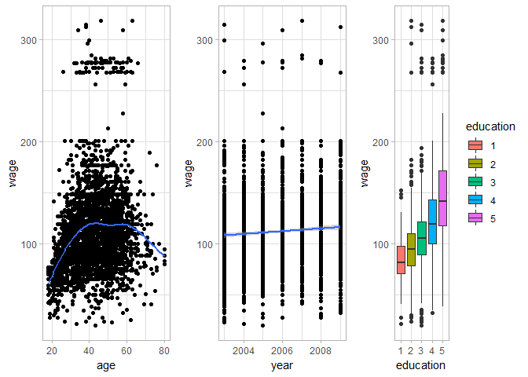
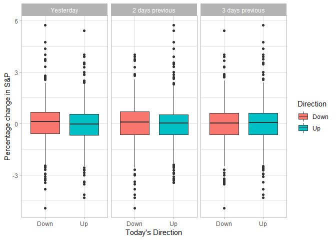

ISLR, chapter 1
================
ms
12/11/2019

Require to load the ISLR package. Also, Tidyverse - my favorite swiss
army knife

    ## Warning: package 'ISLR' was built under R version 3.6.1

    ## Registered S3 methods overwritten by 'ggplot2':
    ##   method         from 
    ##   [.quosures     rlang
    ##   c.quosures     rlang
    ##   print.quosures rlang

    ## Registered S3 method overwritten by 'rvest':
    ##   method            from
    ##   read_xml.response xml2

    ## -- Attaching packages --------------------------------------------------------------------------------------------------------------------------------------------- tidyverse 1.2.1 --

    ## v ggplot2 3.1.1       v purrr   0.3.2  
    ## v tibble  2.1.1       v dplyr   0.8.0.1
    ## v tidyr   0.8.3       v stringr 1.4.0  
    ## v readr   1.3.1       v forcats 0.4.0

    ## -- Conflicts ------------------------------------------------------------------------------------------------------------------------------------------------ tidyverse_conflicts() --
    ## x dplyr::filter() masks stats::filter()
    ## x dplyr::lag()    masks stats::lag()

    ## [1] "D:/ISLR"

### Figure 1.1

This requires us to load the `Wage` data. Let’s load the data and look
at it

``` r
Wage = as_tibble(Wage)
Wage
```

    ## # A tibble: 3,000 x 11
    ##     year   age maritl race  education region jobclass health health_ins
    ##    <int> <int> <fct>  <fct> <fct>     <fct>  <fct>    <fct>  <fct>     
    ##  1  2006    18 1. Ne~ 1. W~ 1. < HS ~ 2. Mi~ 1. Indu~ 1. <=~ 2. No     
    ##  2  2004    24 1. Ne~ 1. W~ 4. Colle~ 2. Mi~ 2. Info~ 2. >=~ 2. No     
    ##  3  2003    45 2. Ma~ 1. W~ 3. Some ~ 2. Mi~ 1. Indu~ 1. <=~ 1. Yes    
    ##  4  2003    43 2. Ma~ 3. A~ 4. Colle~ 2. Mi~ 2. Info~ 2. >=~ 1. Yes    
    ##  5  2005    50 4. Di~ 1. W~ 2. HS Gr~ 2. Mi~ 2. Info~ 1. <=~ 1. Yes    
    ##  6  2008    54 2. Ma~ 1. W~ 4. Colle~ 2. Mi~ 2. Info~ 2. >=~ 1. Yes    
    ##  7  2009    44 2. Ma~ 4. O~ 3. Some ~ 2. Mi~ 1. Indu~ 2. >=~ 1. Yes    
    ##  8  2008    30 1. Ne~ 3. A~ 3. Some ~ 2. Mi~ 2. Info~ 1. <=~ 1. Yes    
    ##  9  2006    41 1. Ne~ 2. B~ 3. Some ~ 2. Mi~ 2. Info~ 2. >=~ 1. Yes    
    ## 10  2004    52 2. Ma~ 1. W~ 2. HS Gr~ 2. Mi~ 2. Info~ 2. >=~ 1. Yes    
    ## # ... with 2,990 more rows, and 2 more variables: logwage <dbl>,
    ## #   wage <dbl>

Note that education has a lot of text which may not be useful for us.
Let us convert that to a factor like follows:

``` r
df <- Wage %>% 
  mutate(education = as.factor(as.numeric(substr(education, 1,1)))) 
```

Now the plot

``` r
p1 <- df %>% 
  ggplot(aes(x = age, y = wage))+
  geom_point()+
  geom_smooth(se = FALSE)

p2 <- df %>% 
  ggplot(aes(x = year, y = wage))+
  geom_point()+
  stat_smooth(method = "lm", 
              formula = y ~ x)
p3 <- df %>% 
  ggplot(aes(x = education, y = wage, fill = education))+
  geom_boxplot()

ggpubr::ggarrange(p1, p2, p3, nrow = 1)
```

    ## `geom_smooth()` using method = 'gam' and formula 'y ~ s(x, bs = "cs")'

<!-- -->

Save the plot

``` r
ggsave(here::here("figures", "Chapter1","figure1_1.jpg"))
```

    ## Saving 7 x 5 in image

### Figure 1.2

This plot uses `Smarket` data. Loading…

``` r
Smarket <- as_tibble(Smarket)
Smarket
```

    ## # A tibble: 1,250 x 9
    ##     Year   Lag1   Lag2   Lag3   Lag4   Lag5 Volume  Today Direction
    ##    <dbl>  <dbl>  <dbl>  <dbl>  <dbl>  <dbl>  <dbl>  <dbl> <fct>    
    ##  1  2001  0.381 -0.192 -2.62  -1.06   5.01    1.19  0.959 Up       
    ##  2  2001  0.959  0.381 -0.192 -2.62  -1.06    1.30  1.03  Up       
    ##  3  2001  1.03   0.959  0.381 -0.192 -2.62    1.41 -0.623 Down     
    ##  4  2001 -0.623  1.03   0.959  0.381 -0.192   1.28  0.614 Up       
    ##  5  2001  0.614 -0.623  1.03   0.959  0.381   1.21  0.213 Up       
    ##  6  2001  0.213  0.614 -0.623  1.03   0.959   1.35  1.39  Up       
    ##  7  2001  1.39   0.213  0.614 -0.623  1.03    1.44 -0.403 Down     
    ##  8  2001 -0.403  1.39   0.213  0.614 -0.623   1.41  0.027 Up       
    ##  9  2001  0.027 -0.403  1.39   0.213  0.614   1.16  1.30  Up       
    ## 10  2001  1.30   0.027 -0.403  1.39   0.213   1.23  0.287 Up       
    ## # ... with 1,240 more rows

Gather the dataset for facet-wrap. This is not probably what the authors
did (*they may have done this using base-r, who knows?*) but this is the
fastest and neatest.

``` r
smarket <- Smarket %>% 
  select(Lag1, Lag2, Lag3, Direction) %>% 
  gather(key = "Lag", value = "Percentage change", c(1:3)) 
```

Now plot

``` r
smarket %>% 
  ggplot(aes(x = Direction, y = `Percentage change`, fill = Direction))+
  geom_boxplot()+
  facet_wrap(~Lag, 
             strip.position = "top",
             labeller = as_labeller(c(Lag1 = "Yesterday", 
                                      Lag2 = "2 days previous",
                                      Lag3 = "3 days previous")))+
  ylab("Percentage change in S&P")+
  xlab("Today's Direction")
```

<!-- -->

``` r
ggsave(here::here("figures","Chapter1","figure1_2.jpg"))
```

    ## Saving 7 x 5 in image

### Figure 1.3

We will come back to this after we cover quadratic discriminant analysis
later

### Figure 1.4

We will come back to this after we cover principal component analysis
later
