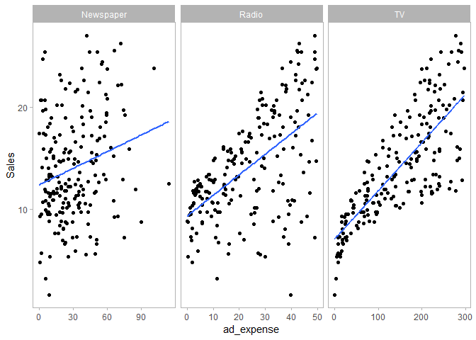

ISLR, chapter 2
================
ms
12/11/2019

### Figure 2.1

Description from ISLR:

> FIGURE 2.1. The `Advertising` data set. The plot displays `sales`, in
> thousands of units, as a function of `TV`, `radio`, and `newspaper`
> budgets, in thousands of dollars, for 200 different markets. In each
> plot we show the simple least squares fit of `sales` to that variable,
> as described in Chapter 3. In other words, each blue line represents a
> simple model that can be used to predict `sales` using `TV`, `radio`,
> and `newspaper`, respectively.

Getting this data was not straightforward. I located this data in an
indirect reference in GitHub Inguen-toan’s
[repo](https://github.com/nguyen-toan/ISLR). Forked this repo for
posterity, and will be using this instead

``` r
Advertising <- read_csv(here("dataset", "Advertising.csv"))
```

    ## Warning: Missing column names filled in: 'X1' [1]

    ## Parsed with column specification:
    ## cols(
    ##   X1 = col_double(),
    ##   TV = col_double(),
    ##   Radio = col_double(),
    ##   Newspaper = col_double(),
    ##   Sales = col_double()
    ## )

``` r
Advertising
```

    ## # A tibble: 200 x 5
    ##       X1    TV Radio Newspaper Sales
    ##    <dbl> <dbl> <dbl>     <dbl> <dbl>
    ##  1     1 230.   37.8      69.2  22.1
    ##  2     2  44.5  39.3      45.1  10.4
    ##  3     3  17.2  45.9      69.3   9.3
    ##  4     4 152.   41.3      58.5  18.5
    ##  5     5 181.   10.8      58.4  12.9
    ##  6     6   8.7  48.9      75     7.2
    ##  7     7  57.5  32.8      23.5  11.8
    ##  8     8 120.   19.6      11.6  13.2
    ##  9     9   8.6   2.1       1     4.8
    ## 10    10 200.    2.6      21.2  10.6
    ## # ... with 190 more rows

Again, it is possible to do this using separate plots, but where is the
fun in that? Let’s gather and facet sales against 3 other plots

``` r
gather_df <- Advertising %>% 
  select(-X1) %>% 
  gather(key = "Medium", value = "ad_expense", -Sales) # Don't need to save this, more for readabilty

gather_df %>% 
  ggplot(aes(x = ad_expense, y = Sales))+
  geom_point()+
  stat_smooth(method = "lm", 
              formula = y ~ x, se=FALSE)+
  facet_wrap(~Medium, scales = "free_x")+
  theme(panel.grid.major = element_blank(), panel.grid.minor = element_blank())
```

<!-- -->

``` r
ggsave(here("figures", "Chapter2", "figure2_1.jpg"))
```

    ## Saving 7 x 5 in image

Note that the `echo = FALSE` parameter was added to the code chunk to
prevent printing of the R code that generated the plot.
